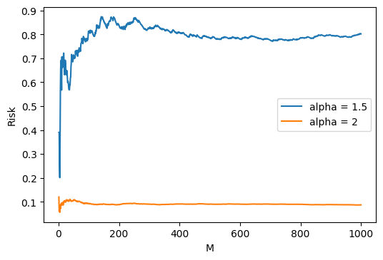
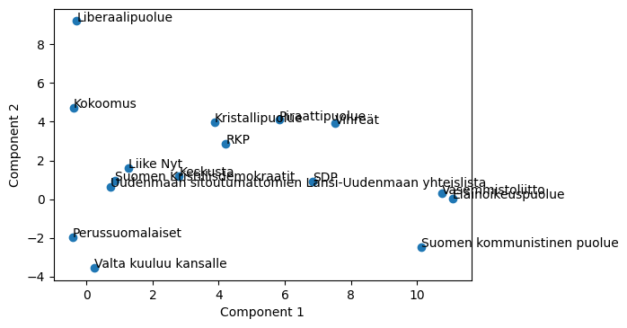

# Exercise 1

We want to evaluate the risk for the loss
$$
\mathcal{L}(y, x, \alpha)=(y-\hat{y})^{2}=(y-\alpha x)^{2}
$$

## Task a

The general definition of risk is the following:
$$
\begin{aligned}
R(\delta)=\mathrm{E}_{p(y, x)}[\mathcal{L}(y, \delta(x))] \\
=\int_{x, y} \mathcal{L}(y, \delta(x)) p(y, x) d x d y
\end{aligned}
$$
Where $\mathcal{L}(y, \delta(x))$ is the expected loss and $p(y, x)$ is the distribution that generates the data points. In this case, we know both:
$$
\mathcal{L}(y, \delta(x)) = \mathcal{L}(y, x, \alpha)=(y-\hat{y})^{2}=(y-\alpha x)^{2}
$$
$$
p(x,y) = p(x)p(y|x)
$$
In the last equation, we know both $p(x)$ and $p(y|x)$:

- $x$ is sampled uniformly in $[-3,3]$, thus this is a simple continuous distribution. Therefore, its probability density function is
$$
\bold{f}_\bold{x}(x) = \left\{\begin{matrix}
\frac{1}{b-a} = \frac{1}{6}& for\ x\ \in [-3,3]\\ 
0 & otherwise
\end{matrix}\right.
$$
- $y|x$ is sampled uniformly in $[2x-\frac{1}{2}, 2x+\frac{1}{2}]$, this this is another simple continuous distribution. Therefore, its probability density function is
$$
\bold{f}_\bold{y|x}(y|x) = \left\{\begin{matrix}
\frac{1}{b-a} = 1 & for\ y\ \in [2x-\frac{1}{2},2x+\frac{1}{2}]\\ 
0 & otherwise
\end{matrix}\right.
$$

Combining the two, we then the joint density function 
$$
\bold{f}_\bold{x,y}(x,y) = \left\{\begin{matrix}
\frac{1}{6} & for\ x \in [-3,3], y\in[2x-\frac{1}{2},2x+\frac{1}{2}]\\ 
0 & otherwise
\end{matrix}\right.
$$

We can then compute the risk $R(\alpha)$:
$$
\begin{aligned}
R(q) &=\int_{x, y} \frac{1}{6}(y-\alpha x)^{2} d x d y \\
&=\int_{y} \int_{x} \frac{1}{6}(y-\alpha x)^{2} d x d y \\
&=\int_{y} \frac{-(y-\alpha x)^{3}}{18 \alpha} d y\\
&=\frac{-(\alpha x-y)^{4}}{72\alpha}
\end{aligned}
$$

In order to find the alpha that gives the smalles risk, we set the last result to zero, calculating also the definite integral over $y$ and $x$; after some math (which is not reported because both too long and trivial, since it's solving a fourth-degree equation), we find that the final result is $\alpha=2$.

## Task b and c

In order to compare the numerical approximation with the true value, I created the following code:

```python
import numpy as np
from matplotlib import pyplot as plt

"""
Create artificial data, 1000 samples
    - x is sampled uniformly between -3 and 3
    - y is sampled uniformly between 2x-0.5 and 2x+0.5
"""
x = np.random.uniform(low=-3, high=3, size=1000)
y = []
for i in x:
    y.append(np.random.uniform(low=2*i-0.5, high=2*i+0.5, size=1)[0])

# R(alpha) with alpha=1.5
M = [i for i in range(1, 1001)]
alpha = 1.5
R = []

for i in M:
    r = 0
    for j in range(0, i):
        r += (y[j]-alpha*x[j])**2
    r/=i
    R.append(r)

# R(alpha) with alpha=2 (true value)
alpha = 2
R2 = []
for i in M:
    r = 0
    for j in range(0, i):
        r += (y[j]-alpha*x[j])**2
    r/=i
    R2.append(r)

# Plot the results
plt.plot(M, R, label='alpha = 1.5')
plt.plot(M, R2, label='alpha = 2')
plt.xlabel('M')
plt.ylabel('Risk')
plt.legend()
```

The result I got follows as a plot.
\newpage
{width=600px}

# Exercise 2

We start with this optimization problem
$$
\begin{aligned}
&\min x^{2}+y^{2} \\
&\text { s.t. } 3 x-y +2 \leq0
\end{aligned}
$$

For convenience, we will call the function to optimize $f(x,y)$ and the inequality constraint $g(x,y)$.

## Task a

The Lagrangian function for this problem is the following: 
$$
\begin{aligned}
\Lambda(x, y, \lambda) &=f(x, y)+\lambda g(x, y) \\
&=x^{2}+y^{2}+\lambda(3 x-y+2)
\end{aligned}
$$

The constraints for $x,y$ to be optimal are:

- There is $\lambda\geq 0$ such that $\nabla f = -\lambda\nabla g$;
- Either $\lambda = 0$ or $g(x,y) = 0$.

## Task b

In order to find an optimal solution, we first compute the gradient of the lagrangian function calculating the partial derivatives with respect to $x$, $y$ and $\lambda$. We then have that:
$$
\nabla \Lambda=\left(\begin{array}{l}
2 x+3 \lambda \\
2 y-\lambda \\
3 x-y+2
\end{array}\right)
$$

We then solve the linear system $\nabla\Lambda=\bold{0}$. With trivial math we get:
$$
\begin{array}{l}
x = -\frac{3}{5}\\\\
y = \frac{1}{5}\\\\
\lambda = \frac{2}{5}
\end{array}
$$

Finally, we check if the results respect the KKT conditions reported in Task a. Since $\lambda\neq 0$, in order for the solution to be optimal we must find $g(x,y)=g\left (-\frac{3}{5},\frac{1}{5}\right ) = 0$; otherwise, the solution is not optimal. Let's then check:
$$
g\left (-\frac{3}{5},\frac{1}{5}\right ) = 3\frac{-3}{5} - \frac{1}{5} + 2 = 0 \leq 0
$$
The constraints are respected, thus the solution is optimal.

# Exercise 5

In order to apply PCA with 2 dimensions I used the code from Exercise 4. The additional code I used is the following:

```python
# Data preparation
X = loadtxt('elec2022.txt', usecols=([i for i in range(1,56)]))
parties = loadtxt('elec2022.txt', usecols=(0))
 # (changed the file using commas for convenience)
parties_names = pd.read_csv('parties.txt', sep=',', header=None)

# Apply PCA using TMC code
x1, x2 = pca(X)

# Prepare output
df = pd.DataFrame()
df['party'] = parties
df['party'] = df['party'].map(parties_names.set_index(0)[1])
df['x1'] = x1
df['x2'] = x2
df = df.groupby(['party']).mean().reset_index()

# Plot the results
fig, ax = plt.subplots()
ax.scatter(df['x1'], df['x2'])
for i, txt in enumerate(df['party']):
    ax.annotate(txt, (df['x1'][i], df['x2'][i]))
plt.xlabel('Component 1')
plt.ylabel('Component 2')
fig.set_dpi(100)
```

The figure I created, with the party labels on each point, follows.

{width=600px}
\newpage