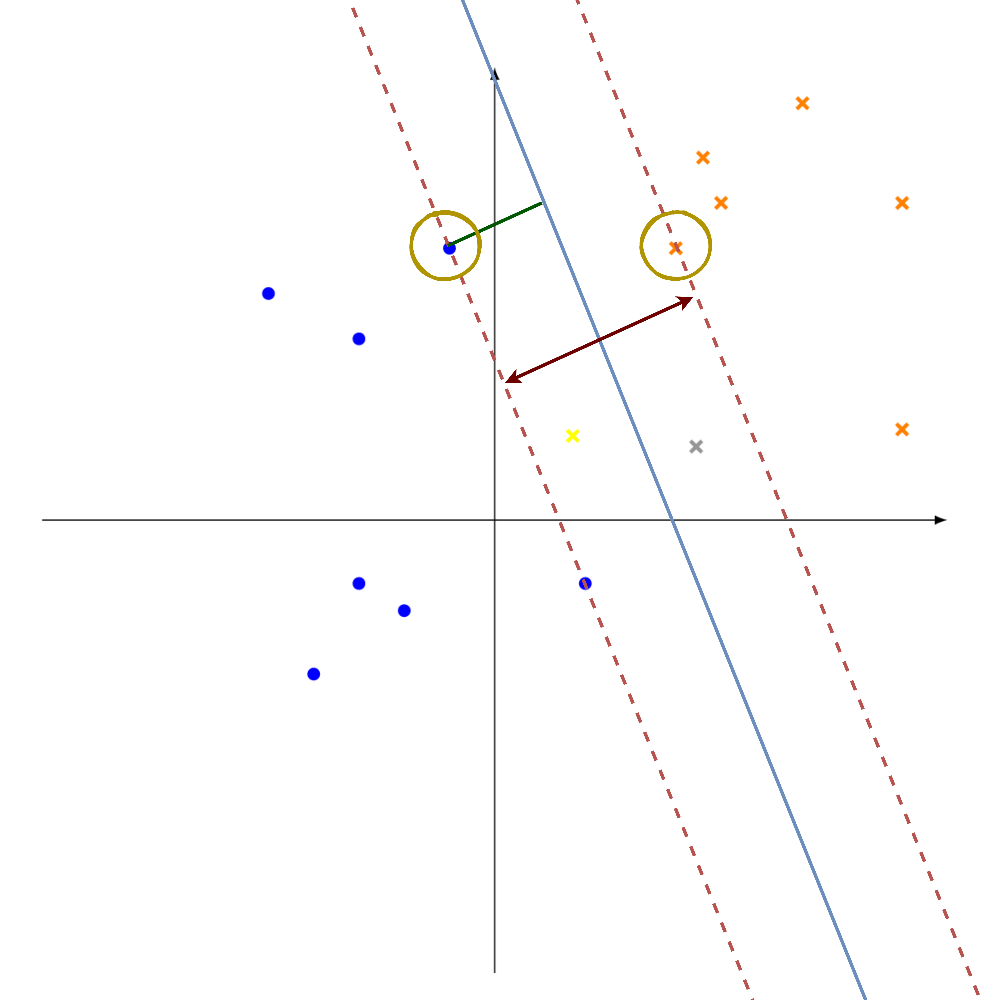

# Exercise 1

## Task a

First of all, we can write the sigmoid function with respect to $\bold{w}^T\bold{x}$:
$$
\operatorname{sigm}(\bold{w}^{\top}\bold{x}) = \frac{1}{1+e^{-\bold{w}^{\top}\bold{x}}}
$$

Now, we can say that
$$
\operatorname{sigm}(-z) = 1 - \operatorname{sigm}(z)
$$

This is true, in fact:
$$
\begin{aligned}
& 1-\frac{1}{1+e^{-z}}=\frac{1}{1+e^{z}} \\
\Rightarrow & \frac{1+e^{-z}-1}{1+e^{-z}}=\frac{1}{1+e^{z}} \\
\Rightarrow & \frac{e^{-z}}{1+e^{-z}}=\frac{1}{1+e^{z}} \\
\Rightarrow & \frac{1 / e^{z}}{1+\frac{1}{e^{z}}}=\frac{1}{1+e^{z}}\\
\Rightarrow & \frac{1}{e^{z}}=\frac{1+e^{-z}}{1+e^{z}}\\
\Rightarrow & \frac{e^{z}+e^{-z} e^{z}}{1+e^{z}}=1\\
\Rightarrow & \frac{1+e^{z}}{1+e^{z}}=1
\end{aligned}
$$

We then have
$$
P(y \mid \bold{w}, \bold{x})=\left\{\begin{array}{ll}
\operatorname{sigm}\left(\bold{w}^{\top} \bold{x}\right) & \text { for } y=1 \\
1-\operatorname{sigm}\left(\bold{w}^{\top} \bold{x}\right)=\operatorname{sigm}\left(-\bold{w}^{\top} \bold{x}\right) & \text { for } y=-1
\end{array}\right.
$$

We can write the formula above in a compact way:
$$
P(y \mid \bold{w}, \bold{x}) = \operatorname{sigm}(y\bold{w}^{\top}\bold{x})
$$

So now we have
$$
\begin{aligned}
&-\sum_{n} \log \left(y_{n} \mid \bold{w}, \bold{x}_{n}\right) \\
=&-\sum_{n} \log \left(\operatorname{sigm}\left(y_{n} \bold{w}^{\top} \bold{x}_{n}\right)\right).\\
=&-\sum_{n} \log \left(\frac{1}{1+e^{-y_{n} \bold{w}^{\top} \bold{x}_{n}}}\right) \\
=& \sum_{n} \log \left(1+e^{-y_{n} \bold{w}^{\top} \bold{x}_{n}}\right)
\end{aligned}
$$

which was the result we were searching for.

## Task b

In order to compute the gradient, as suggested we analyze the negative log-likelihood on different cases.

### Case $y=-1$

We have that
$$
\mathcal{L}=\sum_n \log(1+e^{\bold{w}^{\top}\bold{x}_n})
$$

and we want to show that
$$
\nabla\mathcal{L}=\bold{g}=\bold{X}^T(\bold{\mu}-\bold{0}) = \bold{X}^T\bold{\mu}
$$

with $\mu_n=\operatorname{sigm}(\bold{w}^{\top}\bold{x}_n)$. First of all, we can rewrite $\mathcal{L}$ as a sigmoid for convenience:
$$
\begin{aligned}
\mathcal{L}=-\sum_n \log(\frac{1}{1+e^{\bold{w}^{\top}\bold{x}_n}}) \\
=-\sum_n \log[\operatorname{sigm}(-\bold{w}^{\top}\bold{x}_n)] \\
= -\sum_n \log[1-\operatorname{sigm}(\bold{w}^{\top}\bold{x}_n)]
\end{aligned}
$$

Let's now compute the partial derivative with respects to $\bold{w}^{\top}$:
$$
\begin{aligned}
\frac{\partial}{\partial \bold{w}^{\top}}\log[1-\operatorname{sigm}(\bold{w}^{\top}\bold{x}_n)] \\
=\frac{1}{1-\operatorname{sigm}(\bold{w}^{\top}\bold{x}_n)}\cdot \frac{\partial}{\partial \bold{w}^{\top}}(1-\operatorname{sigm}(\bold{w}^{\top}\bold{x}_n))\\
=\frac{1}{1-\operatorname{sigm}(\bold{w}^{\top}\bold{x}_n)}\cdot\frac{\partial}{\partial \bold{w}^{\top}\bold{x}_n}\operatorname{sigm}(\bold{w}^{\top}\bold{x}_n)\cdot\frac{\partial}{\partial \bold{w}^{\top}}\bold{w}^{\top}\bold{x}_n
\end{aligned}
$$

Now, we know that
$$
\begin{aligned}
\frac{\partial}{\partial \bold{w}^{\top}\bold{x}}\operatorname{sigm}(\bold{w}^{\top}\bold{x}) \\
=\frac{\partial}{\partial \bold{w}^{\top}\bold{x}}(1+e^{-\bold{w}^{\top}\bold{x}})^{-1} = e^{-\bold{w}^{\top}\bold{x}}(1+e^{-\bold{w}^{\top}\bold{x}})^{-2} \\
= \frac{1}{1+e^{-\bold{w}^{\top}\bold{x}}}\cdot\frac{e^{-\bold{w}^{\top}\bold{x}}}{1+e^{-\bold{w}^{\top}\bold{x}}} \\
= \operatorname{sigm}(\bold{w}^{\top}\bold{x})(1-{sigm}(\bold{w}^{\top}\bold{x}))
\end{aligned}
$$

Therefore, the previous partial derivative becomes the following:
$$
\begin{aligned}
\frac{1}{1-\operatorname{sigm}(\bold{w}^{\top}\bold{x}_n)}\cdot(1-\operatorname{sigm}(\bold{w}^{\top}\bold{x}_n))\cdot\operatorname{sigm}(\bold{w}^{\top}\bold{x}_n)\bold{x}_n\\
=\operatorname{sigm}(\bold{w}^{\top}\bold{x}_n)\bold{x}_n
\end{aligned}
$$

We can now compute the gradient and therefore prove the equivalence:
$$
\begin{aligned}
\nabla\mathcal{L} = \frac{\partial}{\partial \bold{w}^{\top}}\mathcal{L} = \operatorname{sigm}(\bold{w}^{\top}\bold{x}_n)\bold{x}_n \\
\Rightarrow -\sum_n\operatorname{sigm}(\bold{w}^{\top}\bold{x}_n)\bold{x}_n=\bold{X}^{\top}\operatorname{sigm}(\bold{w}^{\top}\bold{x}_n)=\bold{X}^{\top}\mu
\end{aligned}
$$

### Case $y=1$

The procedure for this case is almost the same. This time we have that
$$
\mathcal{L}=\sum_n \log(1+e^{-\bold{w}^{\top}\bold{x}_n})
$$

and we want to show that
$$
\nabla\mathcal{L}=\bold{g}=\bold{X}^T(\bold{\mu}-\bold{1})
$$

with $\mu=\operatorname{sigm}(\bold{w}^{\top}\bold{x}_n)$ and $\bold{1}$ a vector of ones. As we did before, we can rewrite $\mathcal{L}$ as a sigmoid for convenience:
$$
\begin{aligned}
\mathcal{L}=-\sum_n \log(\frac{1}{1+e^{-\bold{w}^{\top}\bold{x}_n}}) \\
=-\sum_n \log[\operatorname{sigm}(\bold{w}^{\top}\bold{x}_n)]
\end{aligned}
$$

Let's now compute the partial derivative with respects to $\bold{w}^{\top}$:
$$
\begin{aligned}
\frac{\partial}{\partial \bold{w}^{\top}}\log[\operatorname{sigm}(\bold{w}^{\top}\bold{x}_n)] \\
=\frac{1}{\operatorname{sigm}(\bold{w}^{\top}\bold{x}_n)}\cdot \frac{\partial}{\partial \bold{w}^{\top}}(\operatorname{sigm}(\bold{w}^{\top}\bold{x}_n))\\
=\frac{1}{\operatorname{sigm}(\bold{w}^{\top}\bold{x}_n)}\cdot\frac{\partial}{\partial \bold{w}^{\top}\bold{x}_n}\operatorname{sigm}(\bold{w}^{\top}\bold{x}_n)\cdot\frac{\partial}{\partial \bold{w}^{\top}}\bold{w}^{\top}\bold{x}_n\\
=\frac{1}{\operatorname{sigm}(\bold{w}^{\top}\bold{x}_n)}\cdot(1-\operatorname{sigm}(\bold{w}^{\top}\bold{x}_n))\cdot\operatorname{sigm}(\bold{w}^{\top}\bold{x}_n)\bold{x}_n \\
=(1-\operatorname{sigm}(\bold{w}^{\top}\bold{x}_n))\bold{x}_n
\end{aligned} 
$$

We can now compute the gradient and therefore prove the equivalence in the same way. In the end we get
$$
\nabla\mathcal{L}=\bold{X}^{\top}(\mu - \bold{1})
$$

which is the result we had to find.

Now we can prove also that the Hessian matrix $\bold{H}$ of the loss is equal to
$$
\bold{H}=\bold{X}^{\top}\bold{S}\bold{X}
$$

We can compute the Hessian starting from the gradient we calculated in the previous step. For convenience, let's first put the two cases together into a general result:
$$
\begin{aligned}
\nabla\mathcal{L} = (\operatorname{sigm}(\bold{w}^{\top}\bold{x}_n)-y_n)\bold{x}_n
\end{aligned}
$$

(Note: $y_n$ can be either 0 or 1 in this case, but this is a more general result, thus without loss of generality). The Hessian is then
$$
\begin{aligned}
\nabla^2\mathcal{L}=\frac{\partial}{\partial\bold{w}\partial\bold{w}^{\top}}\mathcal{L} = \bold{x}_n^{\top}\operatorname{sigm}(\bold{w}^{\top}\bold{x}_n)(1-\operatorname{sigm}(\bold{w}^{\top}\bold{x}_n))\bold{x}_n
\end{aligned}
$$

And therefore we have that
$$
\begin{aligned}
\sum_n\bold{x}_n^{\top}\operatorname{sigm}(\bold{w}^{\top}\bold{x}_n)(1-\operatorname{sigm}(\bold{w}^{\top}\bold{x}_n))\bold{x}_n \\
= \bold{X}^{\top}\operatorname{sigm}(\bold{w}^{\top}\bold{x})(1-\operatorname{sigm}(\bold{w}^{\top}\bold{x}))\bold{X} \\
= \bold{X}^{\top}\bold{S}\bold{X}
\end{aligned}
$$

## Task c

In order to prove that the Hessian matrix $\bold{H}$ is positive semidefinite, we have to prove that $\bold{v}^{\top}\bold{H}\bold{v}\geqslant 0$ for a generic vector $\bold{v}\in\mathbb{R}^d$.

Therefore, if we are able to prove that $\bold{X}^{\top}\bold{S}\bold{X}\geqslant 0$, _i.e._ $\bold{S}$ is positive semidefinite, we have also proved that $\bold{H}$ is positive semidefinite.

Now, $\bold{S}$ is positive semidefinite because its eigenvalues are positive; in fact, $\bold{S}$ has only one eigenvalue
$$
\lambda = -[\mu(1-\mu)]^2+\mu(1-\mu)
$$

and this eigenvalue is always greater than 0 because of the definition of $\mu$, which is $0<\operatorname{sigm}(\bold{w}^{\top}\bold{x})\leqslant 1$.

Wrapping up, $\bold{S}$ is positive semidefinite, therefore $\bold{H}$ is positive semidefinite, therefore the loss is convex.

# Exercise 2

## Task a

The results of this task are illustrated in the picture below. The legend and explanation are as follows:

- The decision surface that separate the two classes, _i.e._ the optimal hyperplane, is represented by the blue continuous line. This hyperplane is characterized by $\bold{w}^{\top}\bold{x}+\bold{b} = 0$. The two orange dashed lines are, respectively, the negative hyperplane (on the left of the optimal) and the positive hyperplane (on the right of the optimal). These two hyperplanes are characterized by, respectively, $\bold{w}^{\top}\bold{x}+\bold{b} = -1$ and $\bold{w}^{\top}\bold{x}+\bold{b} = 1$;
- The weight vector is represented by the green line. Note that the direction of the vector is the vector itself, while the lenght is dependent on the bias;
- The support vectors corresponding to $\bold{\alpha}_i > 0$ are pointed by the two yellow circles;
- The margin of the classifier is represented by the brown arrow. Since this is a maximum margin, this is equal to $\frac{2}{\lVert\bold{w}\rVert}$;
- The samples that violate the margin are represented by the two additional crosses:
    - For the grey cross the slack variable $\epsilon_i$ is between 0 and 1;
    - For the yellow cross the slack variable $\epsilon_i$ is bigger than one.

{width=600px}

\newpage
## Task b

We have the SVM primal problem given by
$$
\begin{array}{c}
\min \frac{1}{2}\|w\|^{2} \\
\text { s.t. }\left(\bold{w}^{\top} \bold{x}_{n}+b\right) y_{n} \geqslant 1 \\
\Rightarrow\left(\bold{w}^{\top} \bold{x}_{n}+b\right) y_{n}-1 \geqslant 0
\end{array}
$$

In order to prove the equivalence to its dual problem, we first write the Lagrangian for it; this is
$$
\Lambda(\bold{w}, b, \bold{\alpha})=\frac{1}{2} \bold{w}^{\top} \bold{w}-\sum_{n} \alpha_{n}\left[\left(\bold{w}^{\top} \bold{x}_{n}+b\right) y_{n}-1\right]
$$

Now, in order to find the optimal solution we compute the gradient of $\Lambda$ with respect to $\bold{w}$ and $b$, and we get
$$
\nabla\Lambda(\bold{w}, b, \alpha)=\left(\begin{array}{l}
\sum_{n} \alpha_{n} x_{n} y_{n}-\bold{w} \\
-\sum_{n} \alpha_{n} y_{n}
\end{array}\right)
$$

Then we can solve the linear problem $\nabla\Lambda(\bold{w}, b, \alpha) = \bold{0}$, and we get
$$
\bold{w} = \sum_{n} \alpha_{n} x_{n} y_{n}
$$
$$
\sum_{n} \alpha_{n} y_{n} = 0
$$

We can then plug these results into the Lagrangian for the primal problem and simplify it to check if we get the expected dual problem formulation. The calculations follow:
$$
\begin{aligned}
\Lambda(\bold{w}, b, \alpha)&=\frac{1}{2}\left(\sum_{i} \alpha_{i} y_{i} \bold{x}_{i}^{\top}\right)\left(\sum_{j} \alpha_{j} \bold{x}_{j} y_{j}\right) \\
&+\sum_{i} \alpha_{i} y_{i} b \\
&+\sum_{i} \alpha_{i} \\
&-\sum_{i} \alpha_{i} y_{i}\left(\sum_{i} \alpha_{i} y_{i} \bold{x}_{i}^{\top}\right) \bold{x}^{\top} \\
=& \frac{1}{2} \sum_{i} \sum_{j} \alpha_{j} y_{j} \alpha_{i} y_{i} \bold{x}_{i}^{\top} \bold{x}_{j} \\
&+\sum_{i} \alpha_{i} \\
&-\sum_{i} \sum_{j} \alpha_{j} y_{j} \alpha_{i} y_{i} \bold{x}_{i}^{\top} \bold{x}_{j} \\
=& \sum_{i} \alpha_{i}-\frac{1}{2} \sum_{i} \sum_{j} \alpha_{j} y_{j} \alpha_{i} y_{i} \bold{x}_{i}^{\top} \bold{x}_{j}
\end{aligned}
$$

Maximing this final problem is exactly the same of minimizing the primal problem; therefore, this is proved.