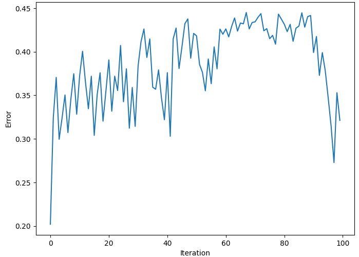
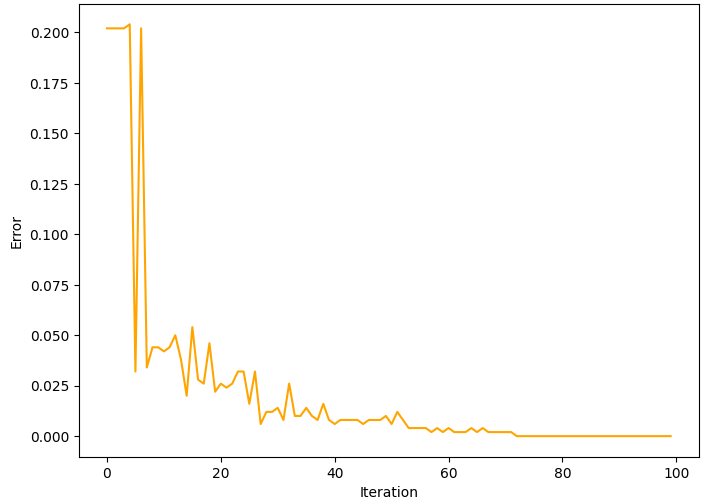
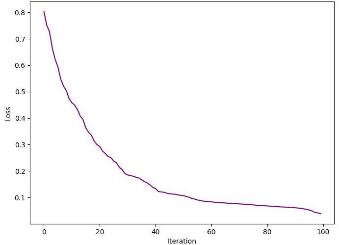
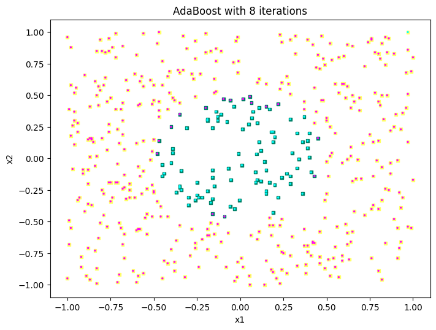
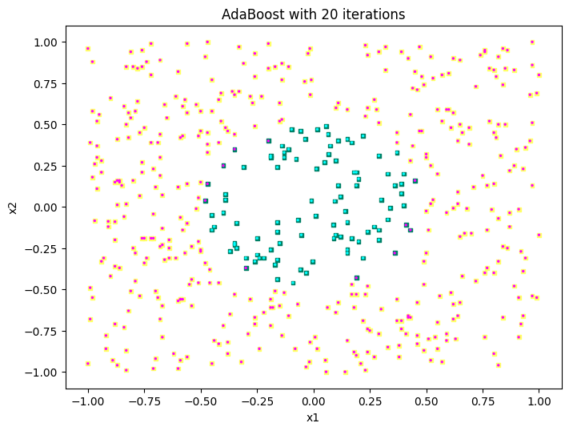
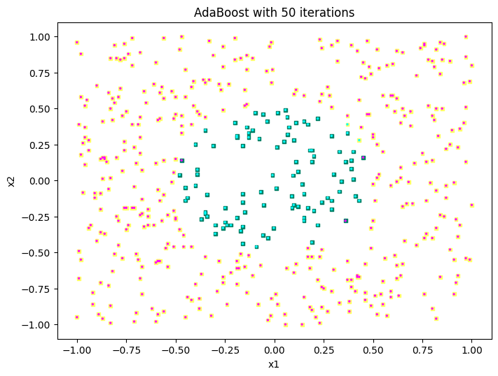
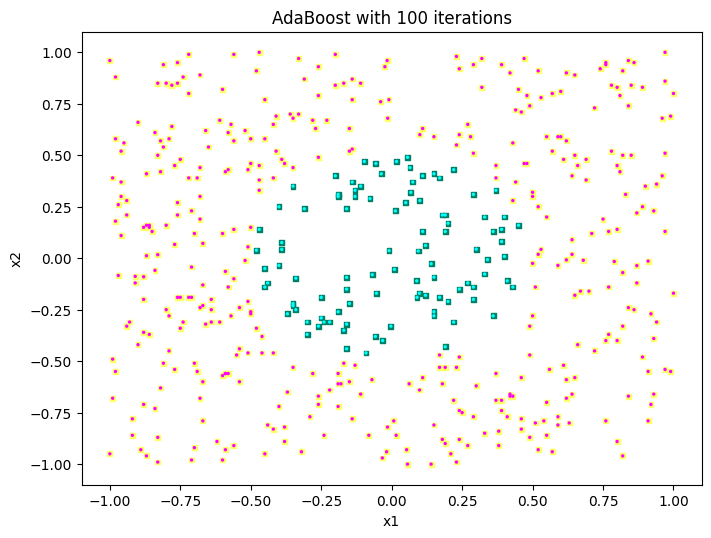

# Exercise 4

## First three plots

In order to plot the first three graphs I firstly loaded the code for AdaGrad I completed in TMC; for brevity, this is not reported as I didn't modify anything. Then, I used some simple code to plot the different measurements as a function of the iteration. This code and the results are reported in the three subsections below; the comment is reported at the end of the document.

### Weighted misclassification of individual classifier

The code I used for this plot is the following.

```python
from matplotlib import pyplot as plt
D = np.loadtxt('toy.txt')
labels = D[:,0].copy()
D[:,0] = 1
output, err_individual, err_ensemble, err_exponential = adaboost(D, labels, 100)
X = [i for i in range(itercnt)]
plt.plot(X, err_individual)
plt.xlabel('Iteration')
plt.ylabel('Error')
```

The result I got follows.

{width=340px}

### Ensemble misclassification error

The first part of code I used for this plot is the same of above; the different part follows.

```python
plt.plot(X, err_ensemble, color='orange')
plt.xlabel('Iteration')
plt.ylabel('Error')
```

The result I got is the following.

{width=340px}

### Normalized exponential loss

The first part of code I used for this plot is the same of above; the different part follows.

```python
plt.plot(X, err_exponential, color='purple')
plt.xlabel('Iteration')
plt.ylabel('Loss')
```

The result I got is the following.

{width=340px}

## Other four plots

After the three plots on error and loss I created the graphs with the data points and their classes for different numbers of iterations. The code for these is reported in the next four pages along with the results; the comment is reported in the end of the document together with the comment for the first three plots. Note that:

- Data points with the correct labels are squares;
- Data points with the predicted labels are circles.

Therefore:

- Yellow squares are correct points with class `1`;
- Green squares are correct points with class `-1`;
- Pink circles are predicted points with class `1`;
- Blue circles are predicted points with class `-1`.

\newpage

### 8 iterations

```python
from matplotlib import pyplot as plt
D = np.loadtxt('toy.txt')
labels = D[:,0].copy()
D[:,0] = 1
output, err_individual, err_ensemble, err_exponential = adaboost(D, labels, 8)
plt.scatter(D[:,1], D[:,2], c=labels, s=12, marker='s', cmap='summer')
plt.scatter(D[:,1], D[:,2], c=np.sign(output), s=8, marker='.', cmap='cool')
plt.title('AdaBoost with {} iterations'.format(8))
plt.xlabel('x1')
plt.ylabel('x2')
```

{width=600px}

\newpage

### 20 iterations

The first part of code I used for this plot is the same of above; the different part follows.

```python
output, err_individual, err_ensemble, err_exponential = adaboost(D, labels, 20)
plt.scatter(D[:,1], D[:,2], c=labels, s=12, marker='s', cmap='summer')
plt.scatter(D[:,1], D[:,2], c=np.sign(output), s=8, marker='.', cmap='cool')
plt.title('AdaBoost with {} iterations'.format(20))
plt.xlabel('x1')
plt.ylabel('x2')
```

{width=600px}

\newpage

### 50 iterations

The first part of code I used for this plot is the same of above; the different part follows.

```python
output, err_individual, err_ensemble, err_exponential = adaboost(D, labels, 50)
plt.scatter(D[:,1], D[:,2], c=labels, s=12, marker='s', cmap='summer')
plt.scatter(D[:,1], D[:,2], c=np.sign(output), s=8, marker='.', cmap='cool')
plt.title('AdaBoost with {} iterations'.format(50))
plt.xlabel('x1')
plt.ylabel('x2')
```

{width=600px}

\newpage

### 100 iterations

The first part of code I used for this plot is the same of above; the different part follows.

```python
output, err_individual, err_ensemble, err_exponential = adaboost(D, labels, 100)
plt.scatter(D[:,1], D[:,2], c=labels, s=12, marker='s', cmap='summer')
plt.scatter(D[:,1], D[:,2], c=np.sign(output), s=8, marker='.', cmap='cool')
plt.title('AdaBoost with {} iterations'.format(100))
plt.xlabel('x1')
plt.ylabel('x2')
```

{width=600px}

\newpage

## Comment

Starting with the first three plots, we can observe the following:

- The weighted errors of individual classifiers are quite stable between $0.25$ and $0.45$; by this we mean that it oscillates a lot in this range, but it does not increase or decrease with a specific pattern through the iterations;
- The ensemble misclassification error, on the other hand, oscillates a lot during the first ~10 iterations, but then it stats converging to $0$;
- The normalized exponential loss tends to zero smoothly through the iterations.

These results are in line with what we would expect from AdaBoost: the operation itself of the algorithm, in fact, works like this. We then have the individual classifiers which are weak learners, thus the error does not decrease naturally. These classifiers are put toghether in an ensemble, and models with lower error rate have more votes, hence the misclassification error decreasing through the iterations. With a higher number of iterations, finally, the model fits more and more to the data, resulting in a decreasing loss.

Coming to the four scatter plots, we can observe the following:

- The ensemble is almost always good in finding the class `1`; in fact, most of the data points in this class are correctly predicted even with only 8 iterations;
- WIth 50 iterations, there is some misclassification in this class; in fact, the boundary for class `-1` seems to expand too much, and this does not happen with lower and higher number of iterations;
- The ensemble has some problems in recognizing class `-1`; in fact, for lower interations the class boundary is too close to the center, meaning a classification of `-1` points into the `1` class;
- Through the iterations, we can observe the boundary between the classes to become closer to the real shape of data; in fact, with 100 iterations the classification on this data is almost perfect.

All these results are in line with the results we had on the errors and loss: the individual classififiers are not performant for sure, but the overall misclassification error of the ensemble tends to zero with the training.