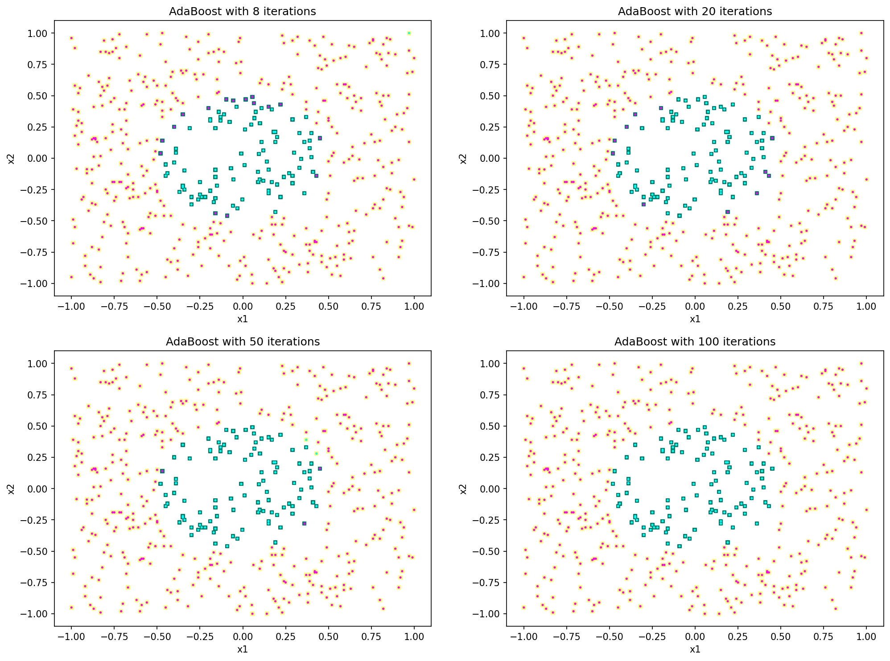

# Exercise 4

## First three plots

In order to plot the first three graphs I firstly loaded the code for AdaGrad I completed in TMC; for brevity, this is not reported as I didn't modify anything. Then, I used some simple code and I plotted the different measurements as a function of the iteration. This code and the results are reported in the three subsections below; the comment is reported at the end of the document.

### Weighted misclassification of individual classifier

The code I used for this plot is the following.

```python
from matplotlib import pyplot as plt
D = np.loadtxt('toy.txt')
labels = D[:,0].copy()
D[:,0] = 1
output, err_individual, err_ensemble, err_exponential = adaboost(D, labels, 100)
X = [i for i in range(itercnt)]
plt.plot(X, err_individual)
plt.xlabel('Iteration')
plt.ylabel('Error')
```

The result I got follows.

{width=340px}

### Ensemble misclassification error

The first part of code I used for this plot is the same of above; the different part follows.

```python
plt.plot(X, err_ensemble, color='orange')
plt.xlabel('Iteration')
plt.ylabel('Error')
```

The result I got is the following.

{width=340px}

### Normalized exponential loss

The first part of code I used for this plot is the same of above; the different part follows.

```python
plt.plot(X, err_exponential, color='purple')
plt.xlabel('Iteration')
plt.ylabel('Loss')
```

The result I got is the following.

{width=340px}

## Other four plots

In order to plot the other four plots I used the following code. Note that:

- Data points with the correct labels are squares;
- Data points with the predicted labels are circles.

Therefore:

- Yellow squares are correct points with class `1`;
- Green squares are correct points with class `-1`;
- Pink circles are predicted points with class `1`;
- Blue circles are predicted points with class `-1`.

```python
from matplotlib.pyplot import figure
D = np.loadtxt('toy.txt')
labels = D[:,0].copy()
D[:,0] = 1
fig, ax = plt.subplots(2, 2, figsize=(16, 12), dpi=150)

output, err_individual, err_ensemble, err_exponential = adaboost(D, labels, 8)
ax[0,0].scatter(D[:,1], D[:,2], c=labels, s=12, marker='s', cmap='summer')
ax[0,0].scatter(D[:,1], D[:,2], c=np.sign(output), s=8, marker='.', cmap='cool')
ax[0,0].set_title('AdaBoost with {} iterations'.format(8))
ax[0,0].set_xlabel('x1')
ax[0,0].set_ylabel('x2')

output, err_individual, err_ensemble, err_exponential = adaboost(D, labels, 20)
ax[0,1].scatter(D[:,1], D[:,2], c=labels, s=12, marker='s', cmap='summer')
ax[0,1].scatter(D[:,1], D[:,2], c=np.sign(output), s=8, marker='.', cmap='cool')
ax[0,1].set_title('AdaBoost with {} iterations'.format(20))
ax[0,1].set_xlabel('x1')
ax[0,1].set_ylabel('x2')

output, err_individual, err_ensemble, err_exponential = adaboost(D, labels,50)
ax[1,0].scatter(D[:,1], D[:,2], c=labels, s=12, marker='s', cmap='summer')
ax[1,0].scatter(D[:,1], D[:,2], c=np.sign(output), s=8, marker='.', cmap='cool')
ax[1,0].set_title('AdaBoost with {} iterations'.format(50))
ax[1,0].set_xlabel('x1')
ax[1,0].set_ylabel('x2')

output, err_individual, err_ensemble, err_exponential = adaboost(D, labels, 100)
ax[1,1].scatter(D[:,1], D[:,2], c=labels, s=12, marker='s', cmap='summer')
ax[1,1].scatter(D[:,1], D[:,2], c=np.sign(output), s=8, marker='.', cmap='cool')
ax[1,1].set_title('AdaBoost with {} iterations'.format(100))
ax[1,1].set_xlabel('x1')
ax[1,1].set_ylabel('x2')
```

The resulting graph is reported in the next page. However, since it can be hard to distinguish the points, the full image is reported with the submission.

\newpage



## Comment